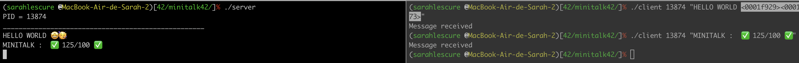

# minitalk

## Score :
✅ 125/100 ✅

## SUJET :

Écrire un programme en C de communication et d'échanges de data en utilisant les signaux UNIX.
Le serveur doit être lancé en premier, puis le client.
Le serveur donne le PID à utiliser et le client la string à imprimer.
Le client communique la string et le serveur doit l'imprimer une fois que l'ensemble de la string a été reçue.
Seuls SIGUSR1 et SIGUSR2 doivent être utilisés.




## HOW TO LAUNCH :

Télécharger le repo :
```
git clone https://github.com/sarahlesc/minitalk.git
cd minitalk
```
Compiler et lancer le programme :
```
make
```
Séparer le terminal en 2 et lancer de chaque côté :
```
./server
```
```
./client <NUM_PID> <string-à-imprimer>
```

## TUTORIAL :
Les caractères seront envoyés de client vers server de façon binaire grâce à SIGUSR1 et SIGUSR2.

Premièrement, on utilise l'opération binaire (&) pour parcourir l'ensemble de la composition binaire du caractère et la comparer à 0x80 = 10000000 afin de la décomposer.

Grâce à cela, on envoie 0 avec SIGUSR1 et 1 avec SIGUSR2 vers server.

Dans serveur, en fonction des signaux reçus (0 ou 1), on utilise les opétations binaires (^) et (|) afin de reconstruire la composition binaire du caractère.

Une fois le caractère entièrement reconstruis, on l'ajoute à notre message. Pour cela, on crée un strjoin qui remalloc à chaque utilisation.

Une fois la string terminée, on envoie un caractère nulle (00000000) depuis client vers server afin de pouvoir afficher le message en entier.

Pour envoyer depuis server vers client que nous avons reçu tout le message, on envoie un signal (SIGUSR2 par exemple) à client qui affichera "MESSAGE RECEIVED".

## RESSOURCES :
- les opérations binaires sur WIKIPEDIA : https://fr.wikipedia.org/wiki/Op%C3%A9ration_bit_%C3%A0_bit

- le wiki sur minitalk de mlanca-c sur GITHUB : https://github.com/mlanca-c/Minitalk/wiki/Unix-Signals
